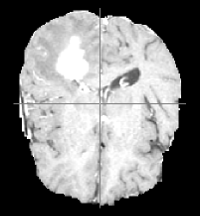
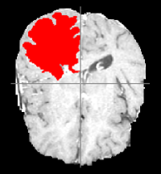
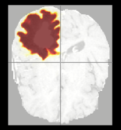

This demo presents how to use NiftyNet for whole tumor segmentation,
which is the first stage of the cascaded CNNs described in the following [paper][wang17_paper].
[wang17_paper]: https://arxiv.org/abs/1709.00382

```
Wang et al., Automatic Brain Tumor Segmentation using Cascaded Anisotropic Convolutional Neural Networks, MICCAI BRATS 2017.
```

For a full implementation of the method described in this paper with three stages of the cascaded CNNs,
please see: https://github.com/taigw/brats17





From left to right: A slice from BRATS17, ground truth of whole tumor,
and segmentation probability map using this demo [1].

*[1] This method ranked the first (in terms of averaged Dice score 0.90499) according
to the online validation leaderboard of [BRATS challenge 2017](https://www.cbica.upenn.edu/BraTS17/lboardValidation.html).*

_Please checkout a trained model in [NiftyNet model zoo](https://github.com/NifTK/NiftyNetModelZoo/blob/master/anisotropic_nets_brats_challenge_model_zoo.md)._


Model training requires
[The Multimodal Brain Tumor Image Segmentation Benchmark (BRATS)](http://10.1109/TMI.2014.2377694).


 * For BRATS 2015, please visit [https://sites.google.com/site/braintumorsegmentation/home/brats2015](https://sites.google.com/site/braintumorsegmentation/home/brats2015).

 * For BRATS 2017, please visit [http://www.med.upenn.edu/sbia/brats2017.html](http://www.med.upenn.edu/sbia/brats2017.html).

To be compatible with the current NiftyNet configuration files and anisotropic
networks, the downloaded datasets must first be preprocessed with [rename_crop_BRATS.py](./rename_crop_BRATS.py).

_For a full implementation of the method described in this paper with three stages of the cascaded CNNs,
please see: [https://github.com/taigw/brats17](https://github.com/taigw/brats17)._
