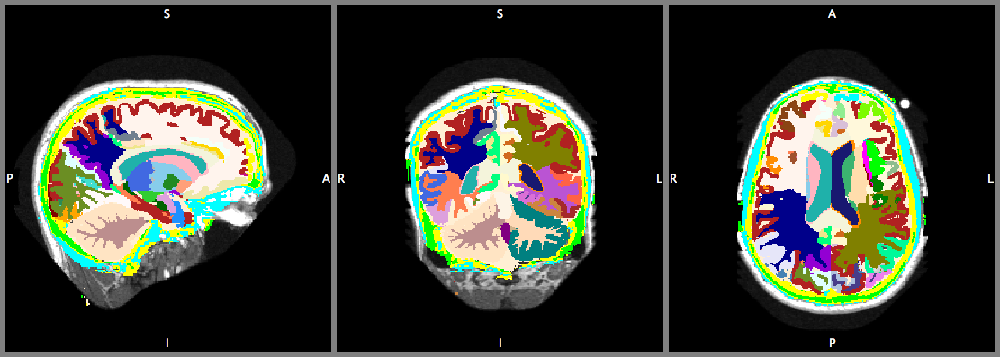

## Brain parcellation demo


Visualisation of segmentation results generated by this demo.


#### Overview
This demo employs a high resolution 3D network using the method
described in
```
Li et al., On the Compactness, Efficiency, and Representation of 3D
Convolutional Networks: Brain Parcellation as a Pretext Task,
In: Information Processing in Medical Imaging (IPMI) 2017.
```
DOI: [10.1007/978-3-319-59050-9_28](http://doi.org/10.1007/978-3-319-59050-9_28)

This demo will download an MR volume and a
trained network model, and then using the NiftyNet inference program to
generate brain parcellation.

_Please visit the [NiftyNet model zoo entry](https://github.com/NifTK/NiftyNetModelZoo/blob/master/highres3dnet_brain_parcellation_model_zoo.md)
for more information on running this demo._
