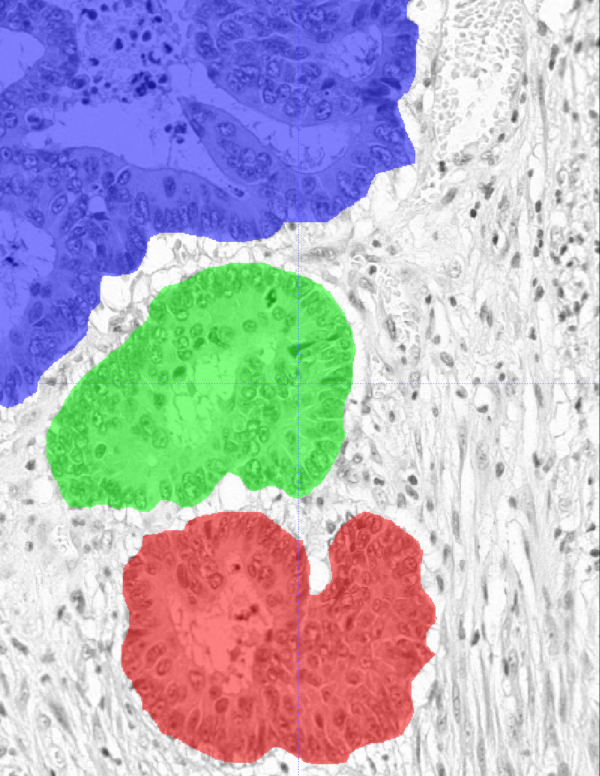
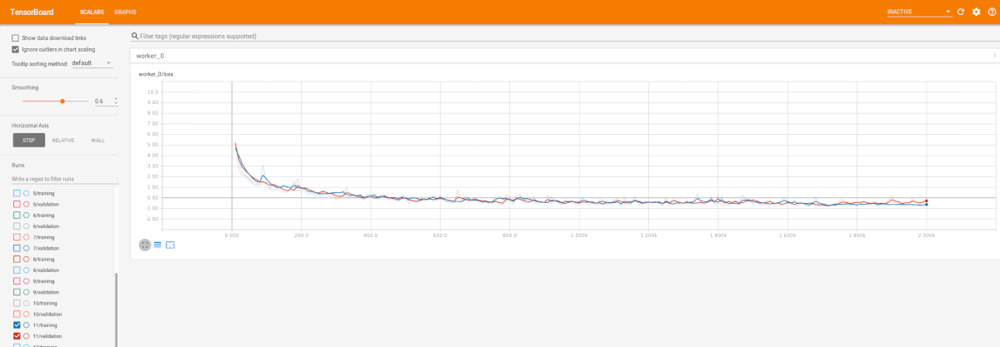

# Training U-Net for Applications in Histology Image Analysis

## Purpose of This Document

This document attempts to explain, in a step-by-step fashion, the operations and considerations that went into the training of the network and the writing of the U-Net example configuration file (`./extensions/unet_histology/config.ini`; path relative to your niftynet home folder). The README file of the U-Net gives a description of the application configuration and its usage, on a more technical level.

This document may be useful to anyone new to NiftyNet who is wishing to adapt the U-net histology example from NiftyNet's model zoo to new data, or training other NiftyNet networks for segmentation applications. A full description of the configuration settings discussed here can be found in the [NiftyNet configuration README](https://niftynet.readthedocs.io/en/dev/config_spec.html).

## Data Preparation

The config, trained weights can be downloaded by
```bash
net_download unet_histology
```
(Replace `net_download` with `python net_download.py` if you cloned the NiftyNet repository; see also: `unet_histology_model_zoo` entry in the [model zoo repo](https://github.com/NifTK/NiftyNetModelZoo)).
By default the data will be downloaded into folder
- `~/niftynet/data/unet_histology` (for demo images);
- `~/niftynet/extensions/unet_histology` (for application configurations);
- `~/niftynet/models/unet_histology` (for trained weights).

The training data was downloaded from [warwick.ac.uk/fac/sci/dcs/research/tia/glascontest/download](https://warwick.ac.uk/fac/sci/dcs/research/tia/glascontest/download/). The data served up by the challenge site contains multinomial training labels with a random labelling order. To make it more suitable for processing by a neural net, a sensible first step is to binarise the target labels using a script similar to the following:
```python
import nibabel as nib
from pathlib import Path
import sys

for image_path in Path(sys.argv[1]).glob('*_anno.nii.gz'):
    img = nib.load(str(image_path))
    img_data = img.get_data()

    img_data[img_data>0] = 1

    nib.save(img, str(image_path))
```

Note: that we converted everything to NIFTI format, prior to any processing, for display with standard medical imaging viewer software, such as itksnap:



If you prefer to skip this conversion you can substitute, e.g., scikit-image's `imread` for nibabel's `load`, and change the file extension in the glob accordingly.

Since the labels have been binarised, a first configuration setting can be immediately set: In the segmentation application-specific section of the configuration file (`SEGMENTATION`), one can set `num_classes = 2`.

## Configuring The Data Set

NiftyNet requires a configuration section describing the data set. For every image type - in this case, we have histology slices and binarised label images - a section has to be created telling the framework how to identify the corresponding image files and what high-level image processing operations to apply when feeding them to the training and inference algorithms. In the case of the histology data set, a first such section called *slice* for histology slices was created, and a second one called *label* for the training labels. In the demo, the images were renamed so that they all carry a prefix `input_`, while label-image file names also have a suffix `_labels`. In the original data set the corresponding prefix and suffix were `train_` and `_anno`. In any case, such a prefix-suffix pair can be used to identify and distinguish images, through `filename_contains` and `filename_not_contains` fields, which in this case for the histology slices are configured as follows:
```ini
filename_contains = input_
filename_not_contains = _labels
```
Since the images have dimensions of 522x775 and 433x574 pixels, and only spatial 2 dimensions, 400x400 was deemed a good size for the patches to subdivide the images into, as it provides a lot of context for any given pixel to classify, while not posing any problem in terms of memory footprint. The 228x228 pixel patch-size for the label images arose from the geometry of the convolutional layers of U-Net and the size of the input patches. The correct geometry for the label-image windows, is printed out by the U-net implementation, and can be found by running the application on the partial configuration file, and looking for the line beginning with `INFO:niftynet: output shape`.

Finally, the data set section tells NiftyNet what interpolation is appropriate for the different image classes. For the histology slices linear interpolation is preferrable, due to its higher geometric fidelity, while for the label images, constant interpolation should be used, as floating point labels cannot be processed. This is expressed through the interpolation polynomial order, that is set to 1 for the histology slices and to 0 for the training label images. These values are not critical in the case of this demo application, as no actual resampling is required for any of the operations carried out by the processing pipeline.

## Network and Training Parameters

Training of a new network in NiftyNet is done through, e.g.,
```bash
net_segment -c ./extensions/unet_histology/config.ini train
```

NiftyNet allows for the addition of various optional image pre-processing layers to the network, and many network classes in NiftyNet have hyper-parameters that, along with the usual training hyper-parameters, can and should be adapted for a given task. In this example, two preprocessing steps were added: 1) standardisation of the image intensities, through the `Whitening` flag, to avoid any problems with the histology slice thickness variation and resulting intensity inhomogeneity between images; 2) padding was applied to ensure that the segmented region stretches all the way to the border. For the latter, the value of 92 pixels was obtained through a trial and error approach, where once the network had trained for a reasonable number of iterations, a few test image segmentations were visually assessed to see if the segmentations fully covered the input images. This value of 92 pixels reappears in the `INFERENCE` section of the configuration file as the argument to the `border` flag.

To have a realistic estimate of the trained network's real life performance, as well as for hyper-parameter tuning and deciding when to stop training, the available training images should be split into a training, a validation and a test data set. The test set should never be used for any kind of assessment of parameter settings, only for checking that the network performs as expected, at the end of training. Its size, in NiftyNet, is expressed as a fraction of all available training images, through `exclude_fraction_for_inference` under `NETWORK`.
The validation data set is more immediately useful in training, and its size was set to the fairly common value of 0.2 through `exclude_fraction_for_validation`.

For the tuning of training and network hyper-parameters, having tensorboard output is very useful. In NiftyNet this is achieved by setting the `tensorboard_every_n` flag to a reasonable value, i.e., one that gives smooth loss function curves while not wasting too many CPU cycles on I/O.

Tensorboard has a web-ui that requires starting a server on the command-line. For this example application, the model directory containing the tensorboard logs was set to `./models/unet_histology`, relative to the niftynet home folder. The actual logs thus reside at `./models/unet_histology/logs`, and tensorboard can be started from the niftynet home folder as follows:
```bash
tensorboard --logdir ./models/unet_histology/logs/
```

The (mini-)batch size is an important parameter in any deep-learning training, typically it is a trade-off between memory footprint and runtime speed, and gradient stability. In this 2D case, memory footprint is not a real problem, but the iterations still do take noticeably longer with larger batches, which can be inconvenient when experimenting with different configuration settings. A size of 5 was found to offer a good trade-off for this application, and that value was set through `batch_size` in the `NETWORK` section.

The learning rate (set through `lr` under `TRAINING`) is another common training hyper-parameter whose best setting can be most easily found by trying a few different values for a few iterations, and choosing the one that leads to the fastest reduction in the training and validation losses. 0.001 is often used as a starting point with NiftyNet's default optimiser ADAM, which was used in this demo.
Too large a step size will will typically lead to an explosion of the loss function, while a step size that is too small may extend the training beyond what is strictly needed, and thus is harder to detect.
If in later iterations, the loss function no longer reduces, it is worth re-trying different values for this settings, and see if really no further loss reduction can be achieved. To restart training at a later iteration, the start iteration for the new training run must be specified through `starting_iter` under `TRAINING`.

Stopping training: tensorboard provides a good way of assessing whether the network has trained sufficiently. To do so, one should look for a region in the loss-function-iteration plot where the loss function for the validation set plateaus, i.e., further iterations do not improve the loss function value. Once a convenient point from that region of the loss-function curve has been picked (i.e., mainly one that coincides with the save frequency of the training specified through `save_every_n`), the corresponding iteration number should be copied to the `inference_iter` field of the `INFERENCE` section of the configuration file. In the above tensorboard screenshot, iteration 1700 would be a good pick.
It is important to pick a point in the plateau region before the curves for the loss function of the training and validation data sets start to diverge, as the curves in the above screenshot do after about 1900 iterations. An increasing validation data set loss with a simultaneously decreasing training data set loss indicates that there is overfitting of the network weights.

There are other settings that are definitely worth experimenting with when creating a new configuration file for a similar application. These include: the type of loss function and the solver/optimiser type. To do so, a strategy similar to that outlined above for the learning rate can be applied, i.e., train the network for a couple of 100s of iterations and pick the setting that leads to the fastest reduction in the loss. Especially for the loss function, it is also important to visually assess that the output looks like a sensible segmentation, since not every loss function is appropriate for every application, despite what tensorboard may say about the reduction in the loss. A list of the supported loss functions and solver classes can be found in the API documentation at [niftynet.readthedocs.io/en/dev/niftynet.layer.loss_segmentation.html](https://niftynet.readthedocs.io/en/dev/niftynet.layer.loss_segmentation.html) and under `OptimiserFactory.SUPPORTED` in [niftynet.readthedocs.io/en/dev/niftynet.engine.application_factory.html#niftynet.engine.application_factory.OptimiserFactory](https://niftynet.readthedocs.io/en/dev/niftynet.engine.application_factory.html#niftynet.engine.application_factory.OptimiserFactory), respectively.

## Evaluation

After training has been completed, the output produced by the network on the test data set should be visually inspected by running
```bash
net_segment -c ./extensions/unet_histology/config.ini inference
```
and retrieving the files from the output folder, which in the example configuration file is set to `./models/unet_histology/output` via the `save_seg_dir` field under the `INFERENCE` heading (note that this field always takes path arguments that are expressed relative to the model folder which is specified through `model_dir` in `SYSTEM`).

Dice scores for the test data set and similar summary performance metrics can also be computed. Doing so requires writing a separate evaluation configuration file section with heading `EVALUATION`, containing the type of metric(s) (`evaluations`), and a destination path for the CSV file containing the scores (`save_csv_dir`).
The actual evaluation can then be accomplished through:
```bash
net_segment -c ./extensions/unet_histology/config.ini evaluation
```


