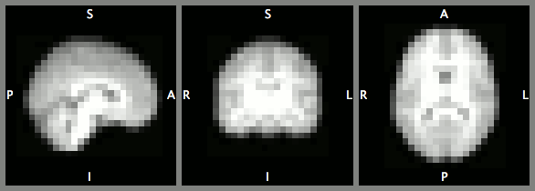

A toy demo of learning representations with variational autoencoders,
from a heavily downsampled version of
 [IXI dataset](http://brain-development.org/ixi-dataset/).


Visualisation of two downsampled T1 images from IXI dataset.



An animation of the learned manifold. Frames are decoded from linearly spaced
(64-dimensional) coordinates in between these two images.

### Overview
This demo provides a minimal working example of variational autoencoders in
medical image analysis using NiftyNet.

It first trains a [variational autoencoder](https://arxiv.org/abs/1312.6114)
using [convolutional VAE network](niftynet/network/vae.py),
then embeds each image using the encoder part of VAE, finally ten linearly
spaced coordinates are computed from a pair of image embeddings and each
coordinate is decoded as an image using the decoder part of VAE.

The following sections describe data preparation, network training, encoding,
and decoding steps using NiftyNet.

1) **Preparing data**

The following commands create a demo folder, and download a downsampled version
of [IXI dataset](http://brain-development.org/ixi-dataset/) (about 59MB):
```bash
# Using "/home/demo/autoencoder_demo/" folder as an example,
# please change this to a preferred system directory if necessary.
export demopath=/home/demo/autoencoder_demo/
mkdir ${demopath}

# download data
wget -c https://www.dropbox.com/s/6c7w6xkxlb2rdqo/downsampled_IXI_data.tar.gz -P ${demopath}
# extract the downloaded data and configuration file
cd ${demopath}; tar -xvf downsampled_IXI_data.tar.gz
```

This step will create a `home/demo/autoencoder_demo/` folder as an example,
and download `IXI_autoencoder` data, [`vae_config_ini`](./vae_config.ini) into
the folder.

2) **Update the downloaded config file**

Change `path_to_search` in the config file (`vae_config.ini` retrieved in the previous downloading step) from
```ini
path_to_search=./data/IXI_autoencoder
```
 to be pointing at the downloaded data (`IXI_autoencoder` folder) from the previous step:
```ini
path_to_search=/home/demo/autoencoder_demo/IXI_autoencoder
```

3) **Train the network**

Using pip installed NiftyNet:
```bash
pip install NiftyNet
cd ${demopath};
# train a variational autoencoder
net_autoencoder train -c ${demopath}/vae_config.ini
```

or using NiftyNet cloned from [GitHub](https://github.com/NifTK/NiftyNet):
```bash
cd NiftyNet/
# train a variational autoencoder
python net_autoencoder.py train -c /home/wenqi/autoencoder_demo/vae_config.ini
```

4) **Encode each image using the encoder network**

With pip installed NiftyNet
```bash
# encode each image using the latest trained model,
# save embeddings to "output/vae_demo_features"
cd ${demopath};
net_autoencoder inference -c ${demopath}/vae_config.ini \
        --inference_type encode \
        --save_seg_dir ${demopath}/output/vae_demo_features \
        --inference_iter -1
```

or using NiftyNet cloned from [GitHub](https://github.com/NifTK/NiftyNet):
```bash
cd NiftyNet;
# encode each image using the latest trained model,
# save embeddings to "output/vae_demo_features"
python net_autoencoder.py inference -c ${demopath}/vae_config.ini \
        --inference_type encode \
        --save_seg_dir ./output/vae_demo_features \
        --inference_iter -1
```

5) **Generating images with linearly spaced coordinates in between two embeddings**

With pip installed NiftyNet:
```bash
cd ${demopath};
# decode image embedding using the latest trained model,
# save generated image to "output/vae_demo_interpolation"
net_autoencoder inference -c ${demopath}/vae_config.ini \
        --inference_type linear_interpolation \
        --save_seg_dir ${demopath}/output/vae_demo_interpolation \
        --inference_iter -1
```

or using NiftyNet cloned from [GitHub](https://github.com/NifTK/NiftyNet):
```bash
cd NiftyNet;
# decode image embedding using the latest trained model,
# save generated image to "output/vae_demo_interpolation"
python net_autoencoder.py inference -c ${demopath}/vae_config.ini \
        --inference_type linear_interpolation \
        --save_seg_dir ./output/vae_demo_interpolation \
        --inference_iter -1
```
