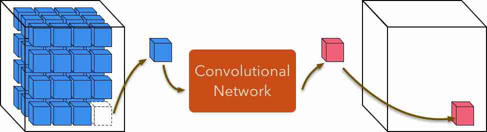
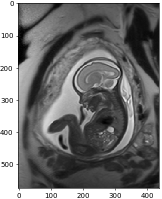
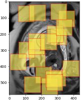
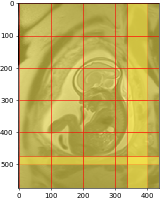
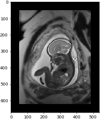
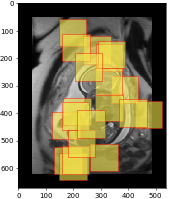
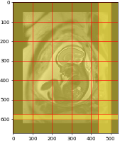
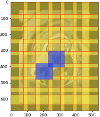
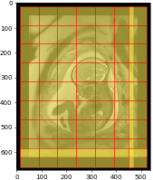
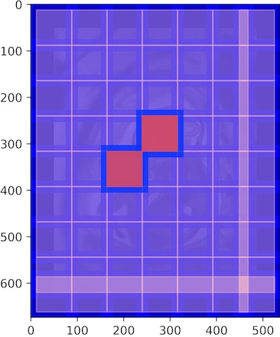

Patch-based analysis
===================

NiftyNet is designed to facilitate patch-based medical image analysis.
This is implemented with two types of extensible modules:

- Window sampler: sampling image windows from volumes.

- Window aggregator: decoding network's output windows and the relevant
  location information, and assembling the volume-level outputs accordingly.



  Image window sampling and aggregation.


The relevant configuration parameters are:

- spatial_window_size,
- volume_padding_size,
- border.

The following sections describes the interaction of these parameters using a
slice of fetal MRI as an example.

The code to generate these visualisations is available: `NiftyNet/demos`__.

.. _code: https://github.com/NifTK/NiftyNet/blob/dev/demos/module_examples/visualise_coordinates.py
__ code_


spatial window size
-------------------
``spatial_window_size`` defines the `spatial` size of the input of a
convolutional network (The full shape is jointly determined
by batch size, spatial window size, and number of modalities/channels of the
input volume). The value of ``spatial_window_size`` should be less or equal
than the spatial size of all the input files.

|original| |uniform0| |grid0|







The above figure shows image window sampling locations with::

  # in the input source section
  spatial_window_size = (100, 100)

from the ``574 x 437``-pixel MRI, using a uniform window sampler and grid
window sampler respectively.

The uniform window sampler first computes a set of all feasible spatial
locations (so that the windows are always within the image) and randomly draws
samples from the set.

The grid window sampler extracts all windows from the volume, with minimal
window overlap when the window size is not divisible by the volume size.  In
other words, it is running a ``100 x 100``-pixel sliding window with a step
size of ``100`` in both spatial dimensions.


volume padding size
-------------------
``volume_padding_size`` could be specified at the training and/or inference
stage so that the input volumes are padded and image windows could be sampled
at the borders of the input volume.  This is also useful when some of the input
volumes are smaller than the spatial window size.

The follow figure shows image window sampling with the configurations::

  # in the input source section
  spatial_window_size = (100, 100)

  # in the [NETWORK] section
  volume_padding_size = (50, 50)
  volume_padding_mode = 'constant'

Note that with padding size equals to 50, 50-pixel will be added to ``both``
ends of each dimension, making the new image size: ``674 x 537`` from (the
original size ``574 x 437``).

|original50| |uniform50| |grid50|








border
------
This parameter is useful at the inference stage, where a "sliding window"
approach is applied to make dense predictions.

If the input and output image windows of a network have the same spatial size,
there is no need for this parameter (```border = 0```)  -- the window sampler
generates image windows and the corresponding spatial coordinates, the
aggregator reads the coordinate information and assigns the output window to
the output volumes.

However, if by design of the network architecture, a network generates a ``76
x 76``-pixel prediction when the input size is ``100 x 100``, we have to adjust
the sampling step of the grid window sampler so that all input spatial
locations get evaluated by the network.

Therefore,

1. for the grid window sampler, we would like to have ``100 x 100``-pixel
   window generated with a step size of ``76`` in both directions;

2. for the window aggregation, the spatial coordinates of the ``76 x 76``-pixel
   window should be adjusted, for example, from the input's window coordinates
   ``[0, 0, 100, 100]`` to the output coordinates ``[12, 12, 88, 88]``, so that
   the output window will be concentric with the corresponding input window.

In NiftyNet, both are achieved by setting ``border`` size to ``12, 12``.

The follow figure shows `input` image window sampling with the configurations::

  # in the input source section
  spatial_window_size = (100, 100)

  # in the [NETWORK] section
  volume_padding_size = (50, 50)
  volume_padding_mode = 'constant'

  # in the [INFERENCE] section
  border = (12, 12)


|original50_12| |grid50_12|




In the above figure, two of the grid window samples are highlighted (blue) to
show the overlap.

The following figure shows how the ``76 x 76`` `output` windows are assigned to
the output volume by the window aggregator.

|grid_cropped_50_12|



To confirm the sampling strategy, we visualise the input (blue) and output
(pink) window grids together.  The windows are concentric; there is overlap for
the ``100 x 100`` input windows, but not for the ``76 x 76`` output windows;
the thickness of the ``border`` in between input and output windows is ``(100 -
76) / 2 = 12`` pixels.

|grid_overlay|



Technically, it is possible to automatically determine ``border`` when the
network design is known at TF graph construction time.  This feature is not
implemented yet (as of Sept. 2018).  So the ``border`` parameter should be set
manually in the configuration.  The formula to compute ``border`` is
``floor((input size - output size) / 2)`` for each spatial dimension.


Other features
----------------------


2.5D windows
~~~~~~~~~~~~
Examples in the previous section are in 2-D, but the idea generalises to 3D input::

  spatial_window_size = (h, w, d)

will make the sampler to generate 3D windows.

Setting the spatial window size to::

  spatial_window_size = (h, w, 1)

will generate 2.5D windows.  Using this configuration with random flipping
layer during training will effectively use 2.5D input in different views.


Image as window
~~~~~~~~~~~~~~~
If all input volume have a consistent size ``h x w x d``, and
in the configuration::

  # in the input source section
  spatial_window_size = (h, w, d)

The input image will be used as ``window``, i.e., there's no randomisation when
this configuration is used with the uniform sampler, and only one window sample
per volume when used with the grid sampler.


Multi-channel inputs
~~~~~~~~~~~~~~~~~~~~
The window samples are generated according to the spatial dimensions only.
``spatial_window_size``, ``volume_padding_size``, and ``border``
accept array values up to three elements.
For multi-channel input images with sizes such as ``height x width x depth x
num_modalities``, the shape of the windows will be
``window height x window width x window depth x num_modalities``.
