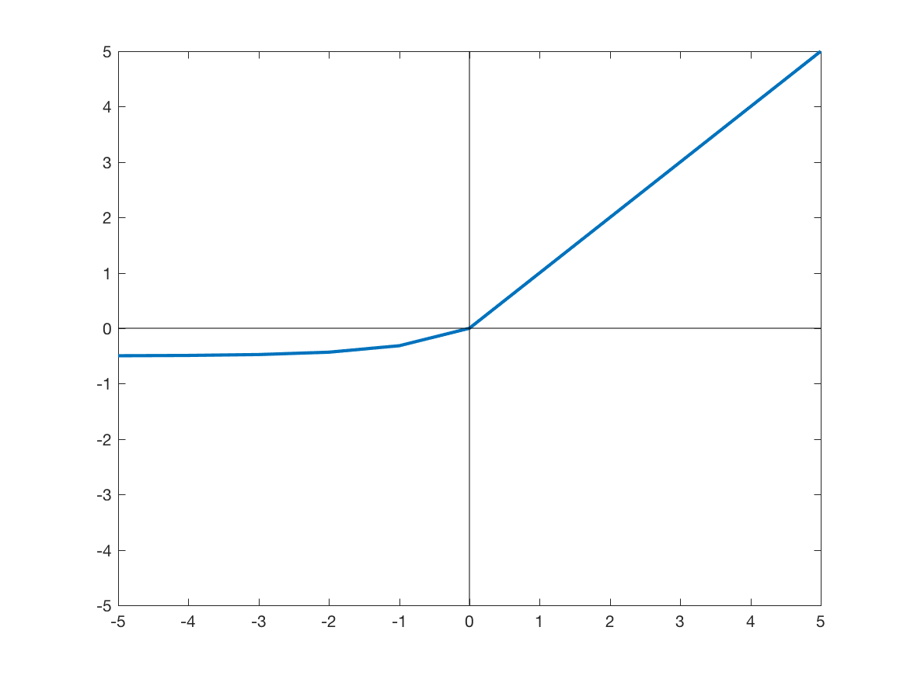
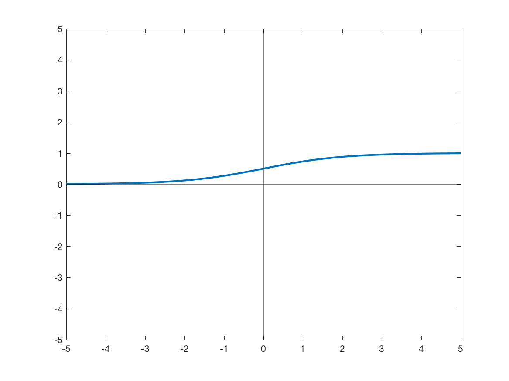
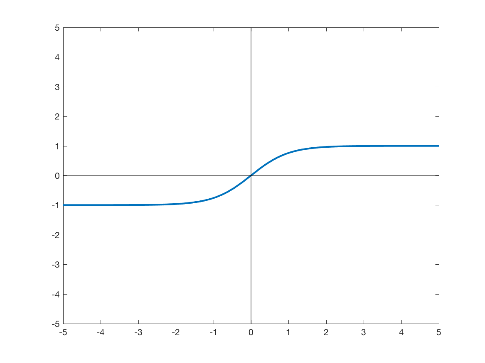
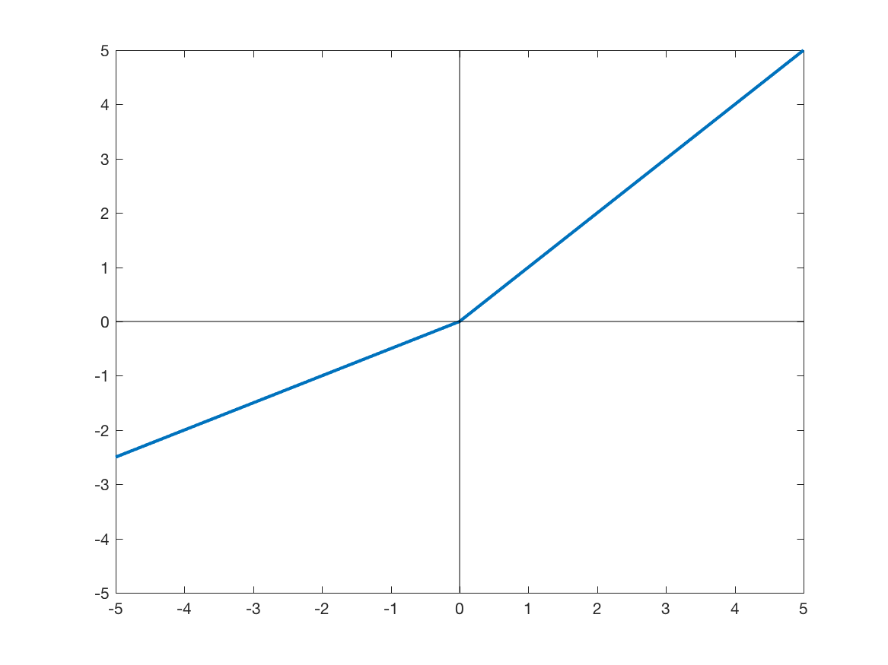

# Layers

Summary of layers that can be used to build networks and their characteristics

## Activation
File: activation.py  
Possible activation layers to be specified as the acti_func field of ConvolutionLayer or DeconvolutionLayer among the following values:  

Field | Equation | Graph  
------|----------|------
relu  || 
relu6 | | tes
elu | | 
softplus | |
softsign | | 
sigmoid | |
tanh | |
prelu | |
dropout | |

## Batch normalisation
File: bn.py  
Class: BNLayer
Fields:  
 
* regularizer: None
* moving_decay: 0.9
* eps
* name
Layer that applies normalisation to the input batch. 

## Convolution
File: convolution.py  
Classes: ConvLayer and ConvolutionLayer

The convolution layer (called as ConvLayer) takes as fields:  

* n_output _chns : Number of output channels/features 
* kernel_size : window size of the convolution 
* stride : Stride with which the kernel is applied
* padding : ['SAME'/'VALID'] Padding strategy applied 
* with_bias: [True/False] Application of a bias
* w_initializer: Initialisation for the weights
* w_regularizer: Regularisation strategy for the weights
* b_initializer: Initialisation strategy for the bias
* b_regularizer: Regularisation strategy for the bias

ConvolutionLayer combines the following optional layers: ConvLayer, batch normalisation, activation,  
Takes as fields those necessary for a ConvLayer, a BatchNormLayer, an activation layer. Dropout is applied according to the argument keep_prob applied when calling the layer.

## Conditional Random Field

## Cropping
File: crop.py  
Class: CropLayer
Operates the cropping of the data it is applied to resulting in the centered part of the data given the field ***border*** cropped in each spatial dimension on both sides.

## Deconvolution
File: deconvolution.py  
Class: DeconvLayer and DeconvolutionLayer

Fields are similar to those needed for ConvLayer

DeconvolutionLayer composes in order the following (optional) layers: deconvolution, batch normalisation, activation and dropout. See the fields and arguments of the convolution file for details.  

## Dilated context
## Downsampling
File: downsample.py  
Class: DownSampleLayer  
Fields:    

* func: ['AVG'/'MAX'/'CONSTANT']. 
* kernel_size: Determines the size of the kernel that will be applied
* stride: Striding parameter of the kernel
* padding: ['SAME'/'VALID']
* name  

## Elementwise operations
File: elementwise.py  
Class: ElementwiseLayer
Fields:  

* func: ['SUM','CONCAT']
* initializer
* regularizer
* name  

Performs elementwise operations between two outputs coming from two different network flows given as arguments.

*Case of SUM operation*: 0 padding is applied on the features dimension for the second argument if the first argument has more features. Projection is made in the opposite case.

## Input normalisation

File: input_normalisation.py
Class: HistogramNormalisationLayer
Fields:  

* models_ filename: Text file with the intensity landmarks trained for each modality. It corresponds to the histogram_ref _file field given on the command line/ config file. If not provided, the folders 
* multimod_mask _type ['and'/'or'/'all']: Strategy applied when creating a mask used for landmark extraction from multiple modalities either as intersection (and), union (or) or considering each modality separately (all)
* norm_type: ['percentile'/'quartile'] strategy of landmarks used for the piecewise linear adaptation
* cutoff: Landmarks cutoff points to be used for the histogram matching. 2 values (min and max) should be given in the range ]0 - 1[ Default value is (0.05,0.95)
* mask_type: ['otsu_plus'/ 'otsu_minus'/ 'thresh_plus'/ 'thresh_minus']. Strategy applied to obtain the image mask
* name

Layer takes as arguments the input 5d image on which to apply the normalisation and flags indicating if any normalisation and/or whitening should be applied.
The normalisation follows [the method](http://ieeexplore.ieee.org/abstract/document/836373/) developed by Nyul et al [^1]
[^1]: Nyúl, L. G., Udupa, J. K., & Zhang, X. (2000). New variants of a method of MRI scale standardization. IEEE transactions on medical imaging, 19(2), 143-150.

## Loss functions
File: loss.py  
Class: LossFunction  
Fields:  

* n_class: Number of classes/labels
* loss_type: ['CrossEntropy'/ 'Dice'/ 'GDSC'/ 'SensSpec'/ 'L1Loss'/ 'L2Loss'/ 'Huber'] Name of the loss to be applied
* loss_func_params: Additional parameters to be used for the specified loss
* name

## Random rotation
File: rand_rotation.py  
Class: RandomRotationLayer  
Fields:  

* min_angle: Minimum angle considered in the random range
* max_angle: Maximum angle considered in the random range

The random rotation belongs to the set of possible augmentation operations.  
*Note* The random rotation is only applied on 3d data

## Random spatial scaling
File: rand_spatial_scaling.py  
Class: RandomSpatialScalingLayer.py  
Fields:  

* max_percentage: Value between 0 and 100 that indicates the range of possible random scaling to be applied.
* name

The random spatial scaling is one of the possible augmentation operations.

## Upsampling
File: upsample.py  
Class: UpSampleLayer  
Fields:  

* func: ['REPLICATE'/'CHANNELWISE_DECONV']
* kernel_size
* stride
* w_initializer
* w_regularizer
* with_bias
* b_initializer
* b_regularizer

This upsampling layer can allow for two strategies of upsampling.   
*Note* if func is REPLICATE, kernel and strides must be of the same size. The data is locally replicated. If func is CHANNELWISE_DECONV, the channels are upsampled separately using a DeconvLayer.